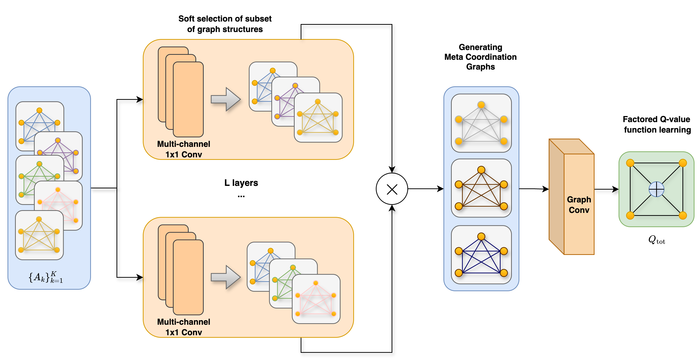
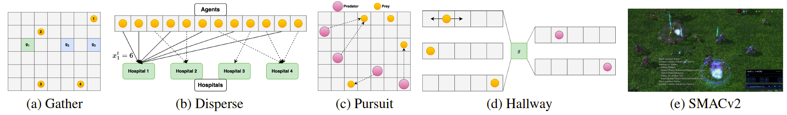
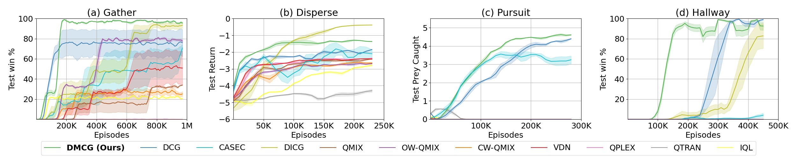

# DMCG: Deep Meta Coordination Graphs for Multi-agent Reinforcement Learning  

This is the code of the implementations of the Deep Meta Coordination Graphs for Multi-agent Reinforcement Learning. 
The code is based on the python/pytorch frameworks [PyMARL](https://github.com/oxwhirl/pymarl), [PyMARL2](https://github.com/hijkzzz/pymarl2) and [DCG](https://github.com/wendelinboehmer/dcg). 

## Abstract 

This paper presents deep meta coordination graphs (DMCG) for learning cooperative policies in multi-agent reinforcement learning (MARL). Coordination graph formulations encode local interactions and accordingly factorize the joint value function of all agents to improve efficiency in MARL. However, existing approaches rely solely on pairwise relations between agents, which potentially oversimplifies complex multi-agent interactions. DMCG goes beyond these simple direct interactions by also capturing useful higher-order and indirect relationships among agents. It generates novel graph structures accommodating multiple types of interactions and arbitrary lengths of multi-hop connections in coordination graphs to model such interactions. It then employs a graph convolutional network module to learn powerful representations in an end-to-end manner. We demonstrate its effectiveness in multiple coordination problems in MARL where other state-of-the-art methods can suffer from sample inefficiency or fail entirely. 


Figure 1: Illustration of Deep meta coordination graphs (DMCG) for learning cooperative policies in MARL. The diagram shows how the approach captures and adapts to multiple types of interactions among agents, including higher-order and indirect relationships, and generates new graph structures by exploring dynamic interactions, even among initially unconnected agents. 
  
## Installation instructions  

#### Dependencies 
Sets up a Python environment with PyTorch, CUDA support, SMACv2, and PyTorch Geometric, along with additional dependencies. Simply run the following to install all required packages. 

```shell 
# require Anaconda 3 or Miniconda 3
conda create -n dmcg python=3.11 -y
conda activate dmcg

bash install_dependencies.sh
 ``` 

#### Environments 
Setting up StarCraft II and SMACv2:    
```shell 
bash install_sc2.sh
 ``` 
This will download SC2 into the 3rdparty folder and copy the maps necessary to run over. 

All environments (gather, disperse, pursuit, hallway, sc2\_gen\_protoss) are implemented in `src/envs` with corresponding configurations in `src/configs/envs`. 

#### Algorithms 

This repository implements DMCG. 
All baseline algorithms (IQL, VDN, QMIX, OW-QMIX, CW-QMIX, QTRAN, QPLEX) can be found here: [PyMARL2](https://github.com/hijkzzz/pymarl2). 
DCG implemetation can be found here: [DCG](https://github.com/wendelinboehmer/dcg). 

## Evaluation domains 


Figure 2: Evaluation environments. The figure shows an example of (a) Gather with g1 as the optimal goal and {g2, g3} as suboptimal goals, (b) Disperse illustrating a need for 6 agents at Hospital 1 at time t, (c) Pursuit where at least 2 predator agents (purple) must coordinate to capture a prey (yellow), (d) Hallway with 2 groups of agents, and (e) a SMACv2 scenario. 

Multi-Agent Coordination (MACO) benchmark
```
@inproceedings{wang2022contextaware,
title={Context-Aware Sparse Deep Coordination Graphs},
author={Tonghan Wang and Liang Zeng and Weijun Dong and Qianlan Yang and Yang Yu and Chongjie Zhang},
booktitle={International Conference on Learning Representations},
year={2022},
url={https://openreview.net/forum?id=wQfgfb8VKTn}
}
```

SMACv2 
```
@inproceedings{ellis2023smacv,
title={{SMAC}v2: An Improved Benchmark for Cooperative Multi-Agent Reinforcement Learning},
author={Benjamin Ellis and Jonathan Cook and Skander Moalla and Mikayel Samvelyan and Mingfei Sun and Anuj Mahajan and Jakob Nicolaus Foerster and Shimon Whiteson},
booktitle={Thirty-seventh Conference on Neural Information Processing Systems Datasets and Benchmarks Track},
year={2023},
url={https://openreview.net/forum?id=5OjLGiJW3u}
}
```

## Replicate the experiments  
As in the PyMARL/PyMARL2/DCG framework, all experiments are run like this:  
```shell  
python3 src/main.py --config=dmcg --env-config=$ENV with $PARAMS 
```  

Replace/Use `$ENV` = **{gather, disperse, pursuit, hallway, sc2\_gen\_protoss}** for replicating desired experiment. 

We used `$PARAMS`: **cg_edges={full, line, cycle, star}** and **seed={0,1,2,3}** to produce the results presented in the paper. 

All results will be stored in the `results` folder. The `sacred` logs containing the results will be stored as `json` files in the `results` folder. 

## Results 


Figure 3: Performance comparison of DMCG against other algorithms in the Gather, Disperse, Pursuit, and Hallway. The results highlight DMCG’s significant outperformance in Gather and Hallway, achieving near-perfect win rates and demonstrating superior sample efficiency. In Disperse, DMCG outperforms all methods while moderately surpassing DCG as well. In the more challenging Pursuit and Hallway tasks, DMCG effectively addresses issues like relative overgeneralization and miscoordination, proving its robustness in environments with partial observability and stochastic dynamics. 
